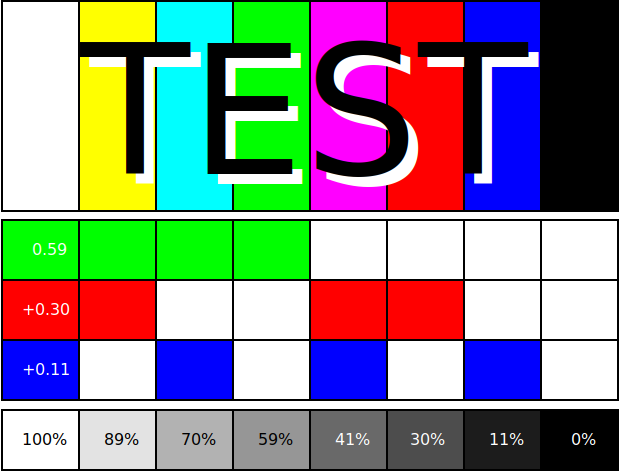

# Planning To-Do

1. How will you communicate with each other?
2. What are you showing? 
3. Write your work descriptions in this document
4. Who is responsible for what in your group?
5. Who is going to design the document / change the fonts etc?
6. Anything else .....

# Work Description Template

If you want to use this pdf to layout work descriptions that you will print to include in the exhibition you might want to change the formatting of the document a bit, remove the page numbers and spacing of the document etc. 

## Title of Work
### Your Name

Work description, approx. 100 words.

# Markdown starting cheatsheet

<!-- This is an HTML comment that won't show in the PDF -->

Markdown is a lightweight markup language with plain-text-formatting syntax. Its design allows it to be converted to many output formats, but the original tool by the same name only supports HTML. Markdown is often used to format readme files, for writing messages in online discussion forums, and to create rich text using a plain text editor. Since the initial description of Markdown contained ambiguities and unanswered questions, the implementations that appeared over the years have subtle differences and many come with syntax extensions. 

More documentation on [https://daringfireball.net/projects/markdown/syntax](https://daringfireball.net/projects/markdown/syntax)

Bold in the pad will not be considered as bold.
One linebreak = no linebreak. Two linebreaks will generate a paragraph break.
Use   to generate a linebreak if needed.

Text *text in italic* text  
text **text in bold** text  
text ***text in bold and italic*** text.

# Header 1
## Header 2
### Header 3

- Item 1
- Item 2
    - Sub-item 1
    - Sub-item 2
- Item 3

1. Numbered item 1
1. Numbered item 2
1. Numbered item 3
5. Numbered item 4

The numbers have no importance, Markdown will number automatically.

Link with title [Link title](http://example.com/)

    Code
    Block

<!-- Image using a url to an image online -->

<!-- Image using a local image -->

